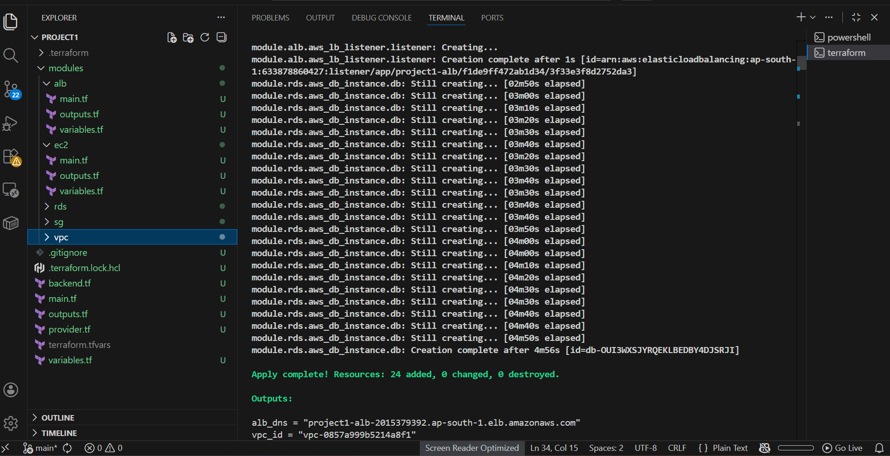
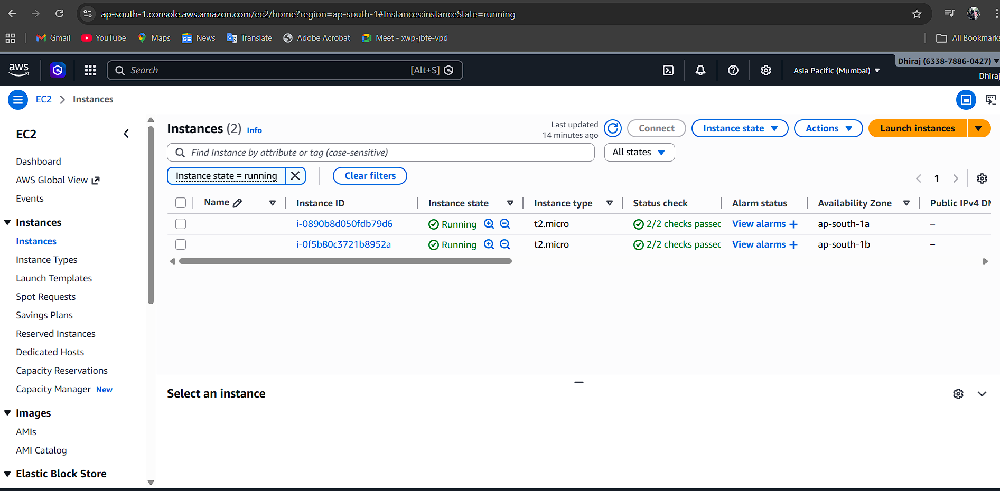
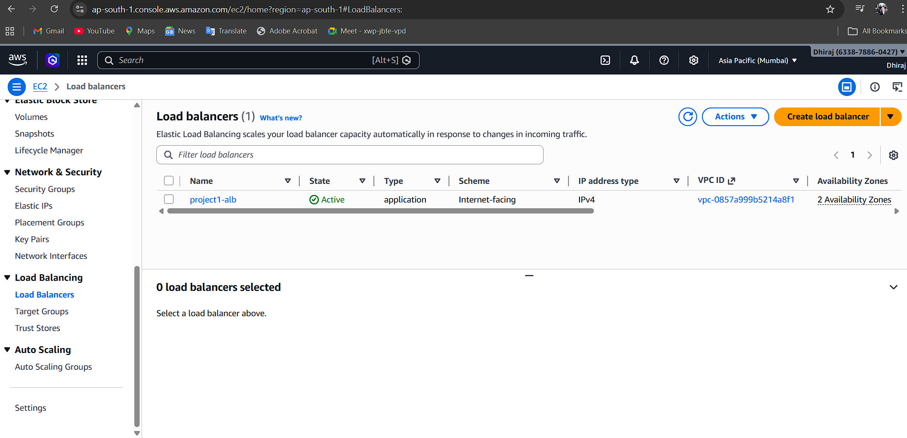
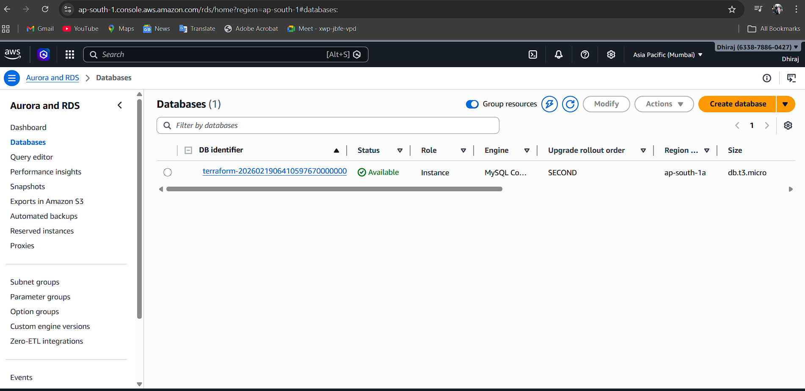
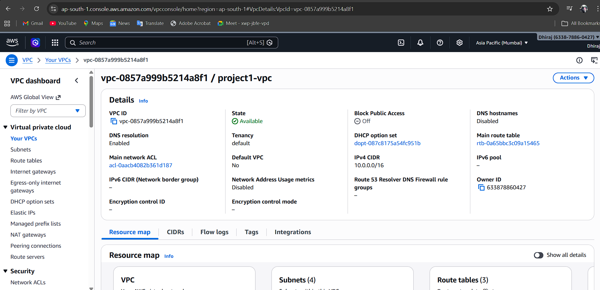

# 🏗️ AWS Multi-Tier Infrastructure with Terraform

[](https://www.terraform.io/)
[](https://aws.amazon.com/)
[](LICENSE)

## 📋 Project Overview

This project implements a complete **multi-tier AWS infrastructure** using Terraform modules. It demonstrates industry best practices for Infrastructure as Code (IaC) with a focus on **high availability**, **security**, and **scalability**.

### Architecture Diagram
                                ┌─────────────────┐
                                │   INTERNET      │
                                └────────┬────────┘
                                         │
                                         ▼
                                ┌─────────────────┐
                                │   LOAD BALANCER │
                                │ (Public Subnet) │
                                └────────┬────────┘
                                         │
                ┌────────────────────────┼────────────────────────┐
                │                        │                        │
                ▼                        ▼                        ▼
      ┌─────────────────┐      ┌─────────────────┐      ┌─────────────────┐
      │  PUBLIC SUBNET  │      │ PRIVATE SUBNET  │      │ SECURE SUBNET   │
      │   AZ-a & AZ-b   │      │  AZ-a & AZ-b    │      │  AZ-a & AZ-b    │
      │                 │      │                 │      │                 │
      │                 │      │  ┌───────────┐  │      │  ┌───────────┐  │
      │                 │      │  │    EC2    │  │      │  │    RDS    │  │
      │                 ├──────►  │  Auto     │  ├──────►  │   MySQL   │  │
      │                 │      │  │  Scaling  │  │      │  │ Database  │  │
      │                 │      │  │   Group   │  │      │  └───────────┘  │
      │                 │      │  └───────────┘  │      │                 │
      │  ┌───────────┐  │      │                 │      │                 │
      │  │    ALB    │  │      │  NAT Gateway    │      │  No Internet    │
      │  └───────────┘  │      │  for Internet   │      │  Access         │
      └─────────────────┘      └─────────────────┘      └─────────────────┘

## 🎯 Features

- ✅ **Modular Terraform** - Reusable modules for each component
- ✅ **Multi-AZ Deployment** - High availability across 2 availability zones
- ✅ **3-Tier Architecture** - Public, Private, and Secure subnets
- ✅ **Auto Scaling** - EC2 instances scale based on CPU utilization
- ✅ **Load Balancing** - Application Load Balancer with health checks
- ✅ **Database Security** - RDS MySQL in private subnets with no internet access
- ✅ **NAT Gateway** - Private instances can access internet for updates
- ✅ **State Management** - S3 backend with DynamoDB locking
- ✅ **Security Groups** - Least privilege access between tiers

## 🏗️ Infrastructure Components

| Component | Description | Location |
|-----------|-------------|----------|
| **VPC** | Custom VPC with CIDR 10.0.0.0/16 | `modules/vpc/` |
| **Subnets** | 6 subnets (2 public, 2 private, 2 secure) | `modules/vpc/` |
| **Internet Gateway** | Internet access for public subnets | `modules/vpc/` |
| **NAT Gateway** | Internet access for private instances | `modules/vpc/` |
| **Security Groups** | ALB, EC2, RDS security rules | `modules/security-groups/` |
| **Application Load Balancer** | Internet-facing ALB | `modules/alb/` |
| **Auto Scaling Group** | EC2 instances with launch template | `modules/asg/` |
| **RDS MySQL** | Managed database in secure subnets | `modules/rds/` |

## 📁 Project Structure
.  
├── main.tf # Root module configuration  
├── variables.tf # Root variables  
├── outputs.tf # Root outputs  
├── terraform.tfvars # Variable values (gitignored)  
├── terraform.tfvars.example # Example variables  
├── backend.tf # S3 backend config (gitignored)  
├── provider.tf # AWS provider config  
├── modules/  
│ ├── vpc/  
│ │ ├── main.tf # VPC resources  
│ │ ├── variables.tf # VPC variables  
│ │ └── outputs.tf # VPC outputs  
│ ├── security-groups/  
│ │ ├── main.tf # Security group resources  
│ │ ├── variables.tf  
│ │ └── outputs.tf  
│ ├── alb/  
│ │ ├── main.tf # ALB, target group, listener  
│ │ ├── variables.tf  
│ │ └── outputs.tf  
│ ├── asg/  
│ │ ├── main.tf # Launch template, ASG, policies  
│ │ ├── variables.tf  
│ │ ├── outputs.tf  
│ │ └── user-data.sh # EC2 bootstrap script  
│ └── rds/  
│ ├── main.tf # RDS instance and subnet group  
│ ├── variables.tf  
│ └── outputs.tf  

## 🚀 Prerequisites

- [Terraform](https://www.terraform.io/downloads) (v1.0+)
- [AWS CLI](https://aws.amazon.com/cli/) configured with appropriate credentials
- AWS account with permissions to create resources
- Basic understanding of AWS services

## 📦 Installation & Deployment

### 1. Clone the Repository

```bash
git clone https://github.com/dhirajrajput2/End-to-End-infra-using-Terraform.git
cd End-to-End-infra-using-Terraform
2. Configure AWS Credentials
You have two options to configure AWS credentials:

Option A: Using AWS CLI (Recommended)

```bash
# Install AWS CLI if not already installed
# For macOS:
brew install awscli

# For Linux (Ubuntu/Debian):
sudo apt-get update
sudo apt-get install awscli -y

# For Windows:
# Download from: https://aws.amazon.com/cli/

# Configure AWS credentials
aws configure
```

When you run aws configure, you'll be prompted to enter:

```
AWS Access Key ID [None]: YOUR_ACCESS_KEY_ID
AWS Secret Access Key [None]: YOUR_SECRET_ACCESS_KEY
Default region name [None]: ap-south-1
Default output format [None]: json
```

Option B: Using Environment Variables

```bash
# Set AWS credentials as environment variables
export AWS_ACCESS_KEY_ID="YOUR_ACCESS_KEY_ID"
export AWS_SECRET_ACCESS_KEY="YOUR_SECRET_ACCESS_KEY"
export AWS_DEFAULT_REGION="ap-south-1"
```

How to Get AWS Credentials:

Log in to AWS Console

Click on your username (top right) → Security Credentials

Under Access keys, click Create New Access Key

Download or copy both:
- Access Key ID
- Secret Access Key


3. Set Up S3 Backend (Optional but Recommended)

```bash
# Create S3 bucket for state (use a globally unique name)
aws s3 mb s3://your-terraform-state-bucket --region ap-south-1

# Enable versioning
aws s3api put-bucket-versioning \
    --bucket your-terraform-state-bucket \
    --versioning-configuration Status=Enabled

# Enable encryption
aws s3api put-bucket-encryption \
    --bucket your-terraform-state-bucket \
    --server-side-encryption-configuration '{
        "Rules": [
            {
                "ApplyServerSideEncryptionByDefault": {
                    "SSEAlgorithm": "AES256"
                }
            }
        ]
    }'

# Create DynamoDB table for state locking
aws dynamodb create-table \
    --table-name terraform-locks \
    --attribute-definitions AttributeName=LockID,AttributeType=S \
    --key-schema AttributeName=LockID,KeyType=HASH \
    --billing-mode PAY_PER_REQUEST \
    --region ap-south-1
```

Update backend.tf with your bucket name:

```hcl
terraform {
  backend "s3" {
    bucket         = "your-terraform-state-bucket"
    key            = "multi-tier-infra/terraform.tfstate"
    region         = "ap-south-1"
    encrypt        = true
    dynamodb_table = "terraform-locks"
  }
}
```


4. Configure Variables

```bash
# Copy example variables file
cp terraform.tfvars.example terraform.tfvars

# Edit with your values
nano terraform.tfvars
```

Set your values in terraform.tfvars:

```hcl
aws_region = "ap-south-1"
project_name = "myapp"
environment = "dev"

vpc_cidr = "10.0.0.0/16"
availability_zones = ["ap-south-1a", "ap-south-1b"]

public_subnet_cidrs  = ["10.0.1.0/24", "10.0.2.0/24"]
private_subnet_cidrs = ["10.0.3.0/24", "10.0.4.0/24"]
secure_subnet_cidrs  = ["10.0.5.0/24", "10.0.6.0/24"]

database_name     = "myappdb"
database_username = "admin"
database_password = "YourSecurePassword123!"  # Change this to a strong password

instance_type = "t2.micro"
asg_min_size = 1
asg_max_size = 2
asg_desired_capacity = 1
```

Password Requirements:

- Minimum 8 characters
- Must contain printable ASCII characters
- Cannot contain: /, @, ", or space


5. Deploy Infrastructure

```bash
# Initialize Terraform
terraform init

# Format code
terraform fmt

# Validate configuration
terraform validate

# Preview changes
terraform plan

# Apply infrastructure
terraform apply
# Type 'yes' when prompted
```

The deployment will take 5-7 minutes. You'll see resources being created in this order:

VPC and networking components

Security groups

RDS database subnet group and database

Load balancer and target group

Launch template and auto scaling group

EC2 instance with Nginx


6. Access Your Application

```bash
terraform output application_url
```

Example output:

```
http://myapp-alb-1234567890.ap-south-1.elb.amazonaws.com
```

Open this URL in your browser - you should see the Nginx welcome page!


7. Verify Resources in AWS Console

Check these services to verify everything is working:

EC2 → Instances: One instance should be running

EC2 → Load Balancers: ALB should be active

EC2 → Auto Scaling Groups: ASG with 1 instance

RDS → Databases: MySQL database should be available

VPC → Your VPCs: Custom VPC with subnets


8. Get Database Connection Details (Optional)

```bash
terraform output database_endpoint
```


9. Clean Up (When Done)

```bash
terraform destroy
# Type 'yes' when prompted
```

This will delete all resources created by this project.


## 📊 Screenshots

### Terraform Apply Complete


### AWS Console - EC2 Instances


### AWS Console - Load Balancer


### AWS Console - RDS Database


### AWS Console - VPC



🛠️ Troubleshooting

Issue | Solution
------|---------
Error: No valid credential sources found | Run aws configure
Invalid MySQL version | Check available versions
Database name error | Use only alphanumeric and underscores
Password error | Password must contain printable ASCII except /@\"
State lock error | Wait or check DynamoDB table
Access denied | Verify IAM permissions
Bucket already exists | Use unique bucket name
terraform init fails | Check internet connection


```bash
aws rds describe-db-engine-versions --engine mysql --region ap-south-1 --query "DBEngineVersions[].EngineVersion"
```

📝 Best Practices Implemented

- Modular design
- Remote state with S3 backend
- State locking with DynamoDB
- Sensitive values not in code
- Tags on all resources
- Least privilege security groups
- Multi-AZ deployment
- Auto scaling
- Health checks
- Database in private subnets


🚀 Future Enhancements

- Add HTTPS with ACM
- Implement WAF
- Add CloudFront
- Blue/Green deployment
- CloudWatch monitoring
- CI/CD pipeline
- Bastion host
- Backup and disaster recovery


📚 Learning Resources

Terraform AWS Provider Documentation  
AWS VPC Documentation  
Best Practices for Terraform  
Space Lift Terraform Guides  


🤝 Contributing

Fork the repository  
Create feature branch  
Commit changes  
Push to branch  
Open Pull Request  

👨‍💻 Author  

Dhiraj Rajput   

GitHub : @dhirajrajput2  

LinkedIn : https://www.linkedin.com/in/rajput-dhiraj/   


🙏 Acknowledgments

HashiCorp for Terraform  

AWS  

DevOps community
